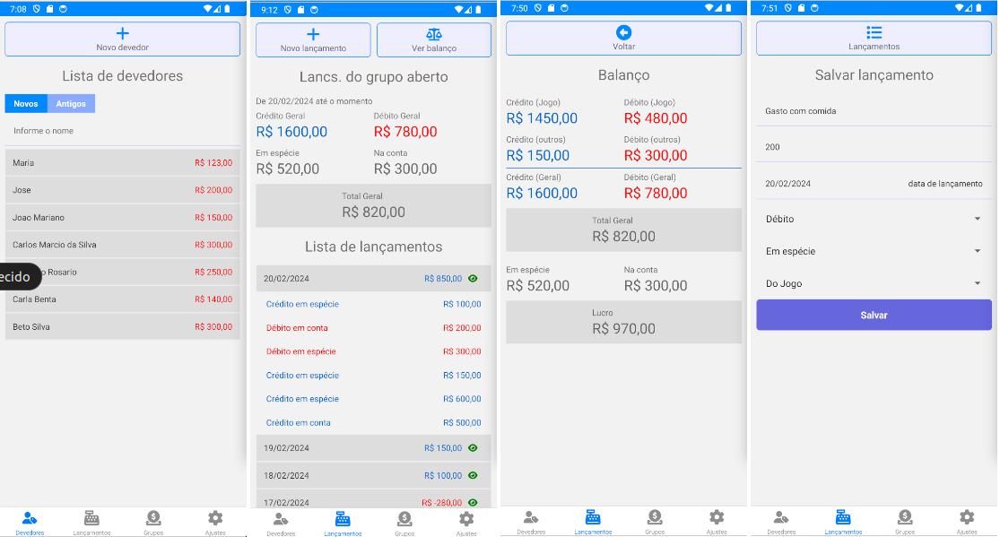

# Aplicativo CJApp



Este é um aplicativo para gestão de contas e devedores de uma casa de jogos.

## Como rodar no emulador

Para rodar no emulador é necessário ter instalado na máquina o android studio, e adicionados a variável de ambiente PATH os caminhos das ferramentas binárias do android studio como abaixo:

```
export ANDROID_SDK_HOME=/home/italo/Android/Sdk
export PATH=$PATH:$ANDROID_SDK_HOME/tools:$ANDROID_SDK_HOME/platform-tools
```

Claro, entenda que esta configuração está de acordo com o linux ubuntu 22.0.4. Se for fazer funcionar no windows, será necessária alterar para a configuração equivalente.

Feito isto, é necessário instalar o emulador. Na época que está sendo produzido este app, o android mais recente é o 14 API 34. Logo, está sendo utilizado para testar um emulador correspondente a estas versões. O nome do Android Virtual Device (AVD) utilizado é “Pixel_3a_API_34_extension_level_7_x86_64”.

### Tecnologias utilizadas além do android studio
   
    • Node v20.11.0
    • Npm 10.4.0
    • React Native 0.73.4
    • react-native-cli 12.3.2

### Instalando as dependências

Para instalar as dependências, entre no diretório cjapp correspondente ao projeto clonado e execute o seguinte comando:

```
npm install
```

Se ocorrer algum problema, execute:

```
rm -rf node_modules package-lock.json
npm install
```

### Rodando o projeto

Para rodar execute o seguinte na raiz do projeto:

```
npx react-native start
```